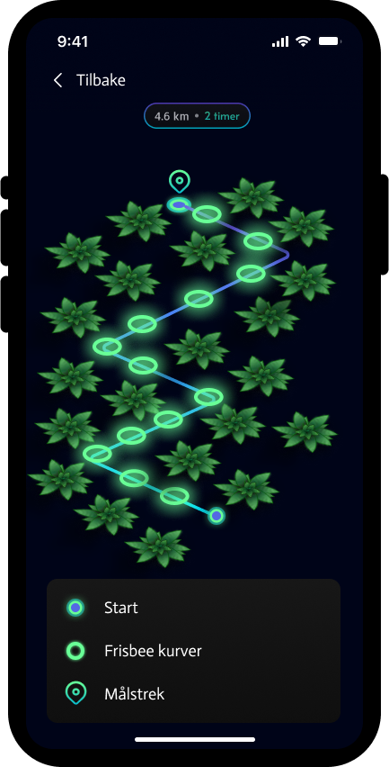
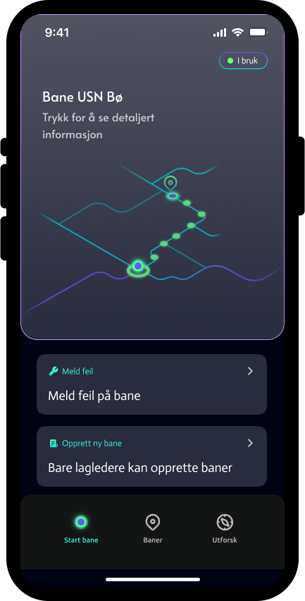
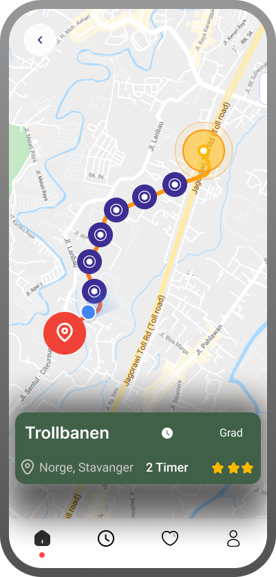
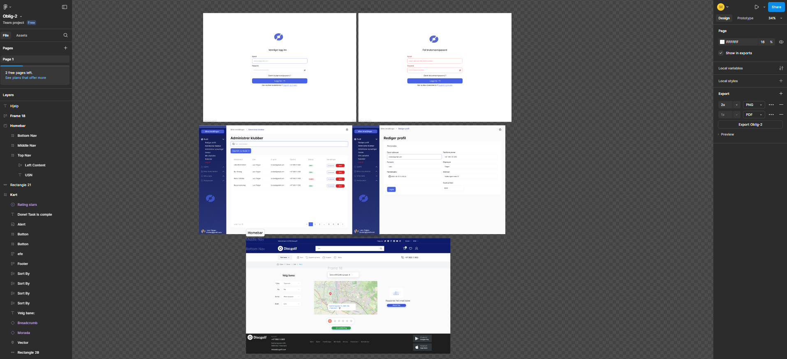

# Discgolf Webapplikasjon - Utkast prototype

## Brukergrensesnittprototyper

**Klikk på bildene for å åpne dem i full størrelse.**

### Dashboard

### Feilinformasjon

### Kart

### Innlogging

### Rediger Profil

### Kart
 

### Kart 2
 

### Kart 3
 

### Alle wireframes i Figma

---

**Merk:** Disse prototypene er laget med Figma og eksportert for å visualisere applikasjonens brukergrensesnitt.
